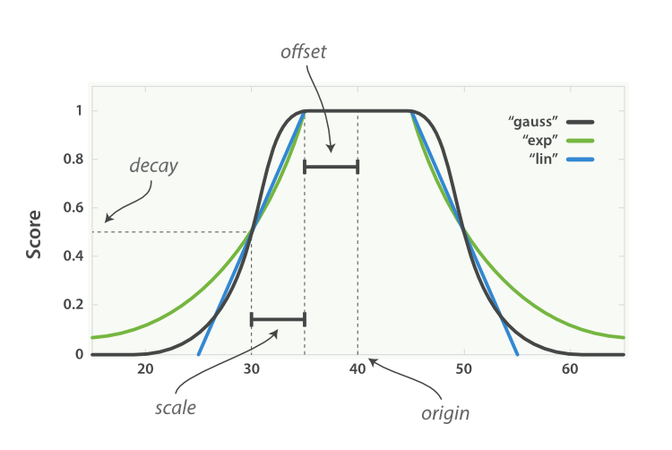

## [Function Score Query](https://blog.csdn.net/wwd0501/article/details/78652850)

> ### <font color="lightpink"  face="思源黑体">优化Elasticsearch搜索结果</font>
#### <table><tr><td bgcolor="lightgreen"><code>function_score 提供了几种默认的计算分值的函数：</code></td></tr></table>

#### 1.  <font color="orange">weight</font>：设置权重
    只需要设置一个数字作为权重，文档的分数就会乘以该权重。
	最大的用途应该就是和过滤器一起使用
#### 2. <font color="orange">field_value_factor</font>：将某个字段的值进行计算得出分数。
通过文档中某个字段的值计算出一个分数，它有以下属性：
- field：指定字段名

- factor：对字段值进行预处理，乘以指定的数值（默认为 1）
- modifier将字段值进行加工，有以下的几个选项：
	- none：不处理
	- log：计算对数
	- log1p：先将字段值 +1，再计算对数
	- log2p：先将字段值 +2，再计算对数
	- ln：计算自然对数
	- ln1p：先将字段值 +1，再计算自然对数
	- ln2p：先将字段值 +2，再计算自然对数
	- square：计算平方
	- sqrt：计算平方根
	- reciprocal：计算倒数
---
```
{
  "query": {
    "function_score": {
      "query": {
        "match": {
          "title": "雨伞"
        }
      },
      "field_value_factor": {
        "field": "sales",
        "modifier": "log1p",
        "factor": 0.1
      },
      "boost_mode": "sum"
    }
  }
}
```
这条查询会将标题中带有雨伞的商品检索出来，然后对这些文档计算一个与库存相关的分数，并与之前相关度的分数相加，对应的公式为：
_score = _score + log (1 + 0.1 * sales)

#### 3. <font color="orange">random_score</font>：随机得到 0 到 1 分数
衰减函数：同样以某个字段的值为标准，距离某个值越近得分越高
调用该函数返回一个 0 到 1 的分数，可以通过seed属性设置一个随机种子，该函数保证在随机种子相同时返回值也相同，这点使得它可以轻松地实现对于用户的个性化推荐。

#### 4. <font color="orange">衰减函数（Decay Function）</font>：以某个字段的值为标准，距离某个值越近得分越高
它描述了这样一种情况：对于一个字段，它有一个理想的值，而字段实际的值越偏离这个理想值（无论是增大还是减小），就越不符合期望。这个函数可以很好的应用于数值、日期和地理位置类型，由以下属性组成：
 1. 原点（origin）：该字段最理想的值，这个值可以得到满分（1.0）

 2. 偏移量（offset）：与原点相差在偏移量之内的值也可以得到满分
 3. 衰减规模（scale）：当值超出了原点到偏移量这段范围，它所得的分数就开始进行衰减了，衰减规模决定了这个分数衰减速度的快慢
 4. 衰减值（decay）：该字段可以被接受的值（默认为 0.5），相当于一个分界点，具体的效果与衰减的模式有关。
衰减函数还可以指定三种不同的模式：线性函数（linear）、以 e 为底的指数函数（Exp）和高斯函数（gauss），它们拥有不同的衰减曲线：

**e.g**
我们希望租房的位置在40, 116坐标附近，5km以内是满意的距离，15km以内是可以接受的距离:
```
{
  "query": {
    "function_score": {
      "query": {
        "match": {
          "title": "公寓"
        }
      },
      "gauss": {
        "location": {
          "origin": { "lat": 40, "lon": 116 },
          "offset": "5km",
          "scale": "10km"
           }
         },
         "boost_mode": "sum"
    }
  }
}
```
#### 5. <font color="orange">script_score</font>：通过自定义脚本计算分值
虽然强大的 field\_value\_factor 和衰减函数已经可以解决大部分问题了，但是也可以看出它们还有一定的局限性：

1. 这两种方式都只能针对一个字段计算分值

2. 这两种方式应用的字段类型有限，field\_value\_factor 一般只用于数字类型，而衰减函数一般只用于数字、位置和时间类型
这时候就需要 script_score 了，它支持我们自己编写一个脚本运行，在该脚本中我们可以拿到当前文档的所有字段信息，并且只需要将计算的分数作为返回值传回Elasticsearch 即可。

> 使用脚本需要首先在配置文件中打开相关功能：
```
script.groovy.sandbox.enabled: true
script.inline: on
script.indexed: on
script.search: on
script.engine.groovy.inline.aggs: on
```
它还有一个属性boost_mode可以指定计算后的分数与原始的_score如何合并，有以下选项：
  - <font color="green">multiply</font>：将结果乘以_score

  - <font color="green">sum</font>：将结果加上_score
  - <font color="green">min</font>：取结果与_score的较小值
  - <font color="green">max</font>：取结果与_score的较大值
  - <font color="green">replace</font>：使结果替换掉_score

